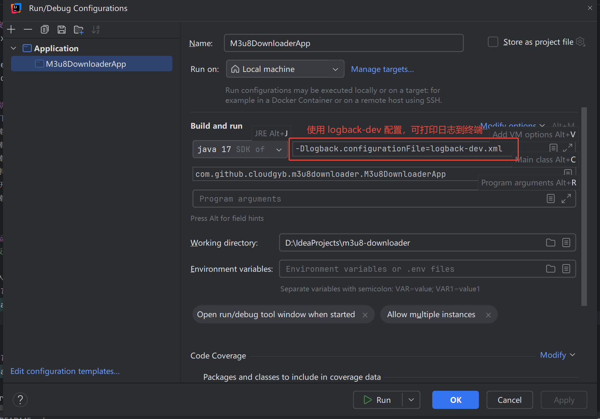
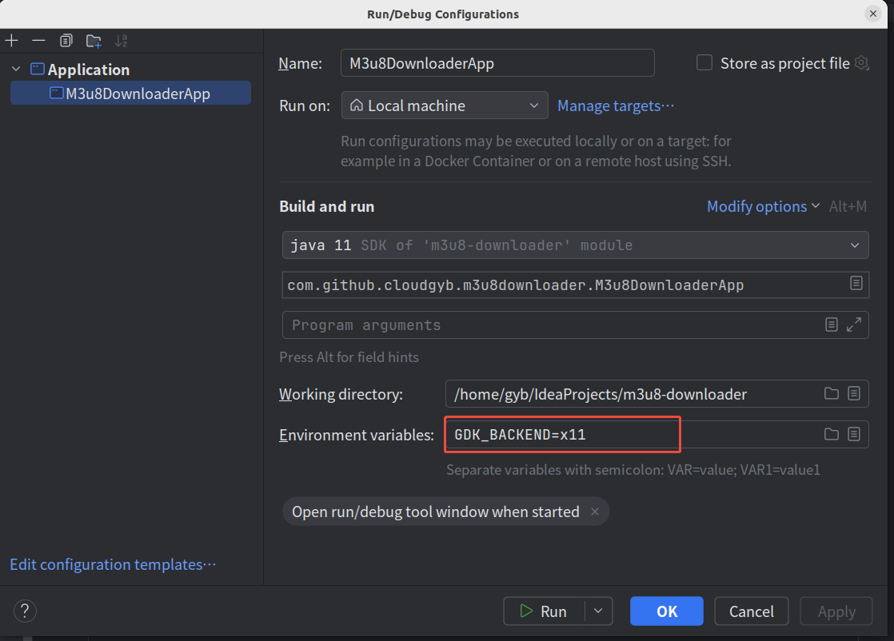
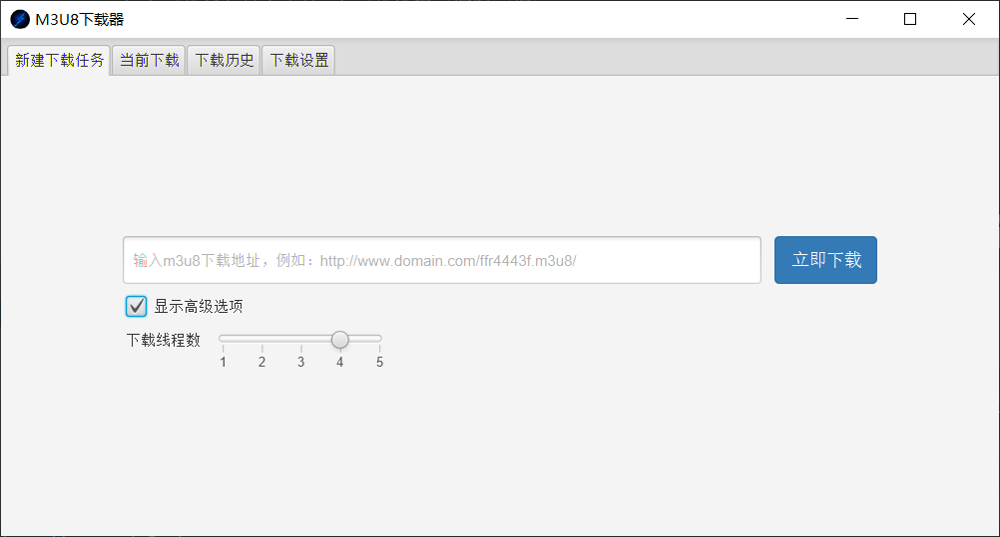
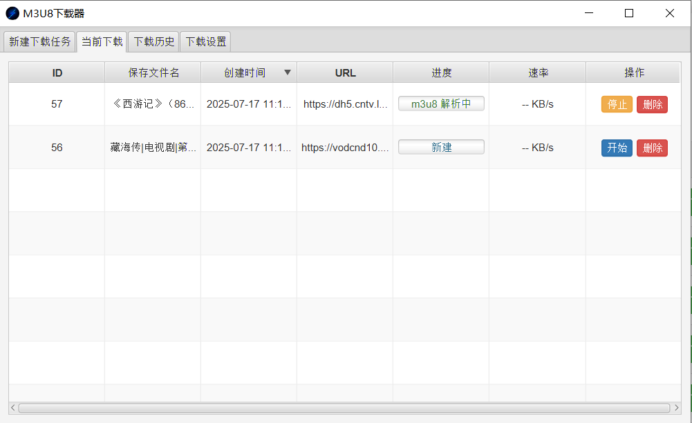
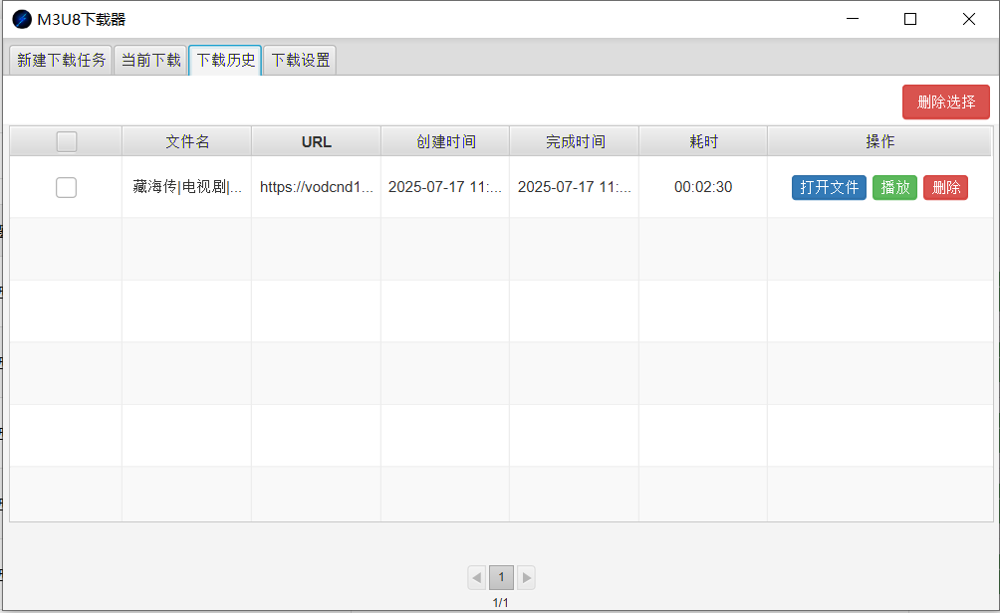
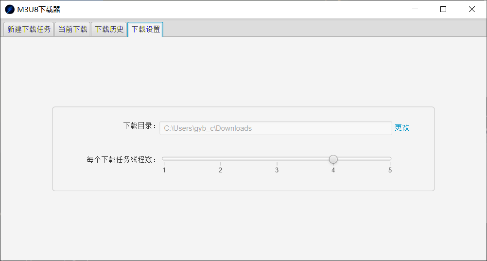

#  M3U8高速下载器

[](https://github.com/cloudgyb/m3u8-downloader/blob/main/LICENSE)
[](https://github.com/cloudgyb/m3u8-downloader/stargazers)
[](https://github.com/cloudgyb/m3u8-downloader/forks?include=active%2Carchived%2Cinactive%2Cnetwork&page=1&period=2y&sort_by=stargazer_counts)
[](https://github.com/cloudgyb/m3u8-downloader/issues)

## 什么是M3U8？

M3U8 是 Unicode 版本的 M3U，用 UTF-8 编码。
"M3U" 和 "M3U8" 文件都是苹果公司使用的 HTTP Live Streaming（HLS） 协议格式的基础，这种协议格式可以在 iPhone 和 Macbook
等设备播放。
现在大多数视频网站都采用这种协议来提供视频播放服务。

> HLS 的工作原理是把整个流分成一个个小的基于 HTTP
> 的文件来下载，每次只下载一些。当媒体流正在播放时，客户端可以选择从许多不同的备用源中以不同的速率下载同样的资源，允许流媒体会话适应不同的数据速率。在开始一个流媒体会话时，客户端会下载一个包含元数据的
> extended M3U (m3u8) playlist文件，用于寻找可用的媒体流。
> HLS 只请求基本的 HTTP 报文，与实时传输协议（RTP）不同，HLS 可以穿过任何允许 HTTP 数据通过的防火墙或者代理服务器。它也很容易使用内容分发网络来传输媒体流。

## M3U8视频下载的原理

基于上面HLS的原理，首先将m3u8 playlist文件（.m3u8后缀）下载下来解析器其内容，获取每一段视频的链接(.ts为后缀的链接)
，采用多线程的方式分组下载，最终合成一个文件，这样就完成了下载。
下面是一个m3u8文件的例子：

```m3u8
#EXTM3U
#EXT-X-TARGETDURATION:10

#EXTINF:9.009,
https://media.example.com/first.ts
#EXTINF:9.009,
https://media.example.com/second.ts
#EXTINF:3.003,
https://media.example.com/third.ts
```

+ m3u8 文件的每一行要么是一个 URI，要么是空行，要么就是以 # 开头的字符串。不能出现空白字符，除了显示声明的元素。

+ m3u8 文件中以 # 开头的字符串要么是注释，要么就是标签。标签以 #EXT 开头，大小写敏感。

## 项目使用的技术及运行环境要求

+ javafx：11.0.2+
+ Java：11.0.1+
+ sqlite-jdbc：3.34.0
+ UI: BootstrapFX

## 项目特点

+ 跨平台，支持 Windows、Linux、MacOS 等系统
+ 多线程下载，下载速度贼快
+ 每个下载任务最多支持5个下载线程（源码可调）
+ 每个下载任务可以自定义下载线程数
+ 提供下载历史列表，方便用户查看
+ 同时支持多个下载
+ 直接打开播放（使用外部系统默认播放器）
+ ...

## 法律声明

在使用本软件之前，请务必阅读并理解以下法律文件：

+ [免责声明](docs/disclaimer.md)
+ [最终用户许可协议](docs/eula.md)

## 本地运行

> Java版本必须>=11.0.2，因为项目使用了Java模块化开发

- Windows 环境准备

由于运行时需要 ffmpeg.exe 合并视频片段所以需要
进入项目的```src/assembly/bin``` 目录手动解压[ffmpeg.exe.zip](src/assembly/bin/ffmpeg.exe.zip)到```src/assembly/bin```

- Linux 环境准备

1. 由于运行时需要 ffmpeg 合并视频片段所以需要进入项目的```src/assembly/bin```
   目录手动解压[ffmpeg.zip](src/assembly/bin/ffmpeg.zip)到```src/assembly/bin```
2. 将 JDK bin 目录添加到环境变量中，否则运行可能会找不到 jlink

### maven 命令直接运行

运行，进入项目根目录执行：

```shell
mvn clean javafx:run 
```

### IDEA 运行

配置 logback-dev.xml 打印日志到控制台
<br/>


> Linux IDEA 运行
  在 Ubuntu 环境下需要配置环境变量，否则运行 Java 虚拟机会报错
  <br/>
  

## 打包

> 由于项目打包使用的是 jlink 打包，直接生成可执行的二进制，所以不同操作系统需要去相应的环境下打包

```shell
mvn clean package
```

将会在target目录生成m3u8-downloader-release-<version>运行时目录和m3u8-downloader-release-<version>.zip压缩的运行时环境。

## 截图

**新建下载任务**<br>


**下载列表**<br>


**下载历史列表**<br>


**下载设置**<br>


## 参与开发

请 Fork 本项目然后提交 PR。